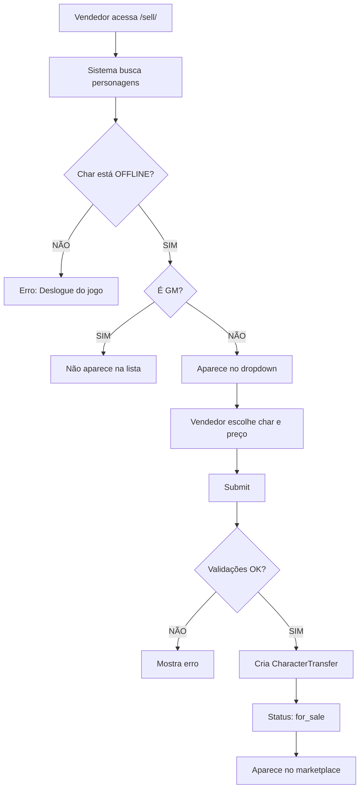
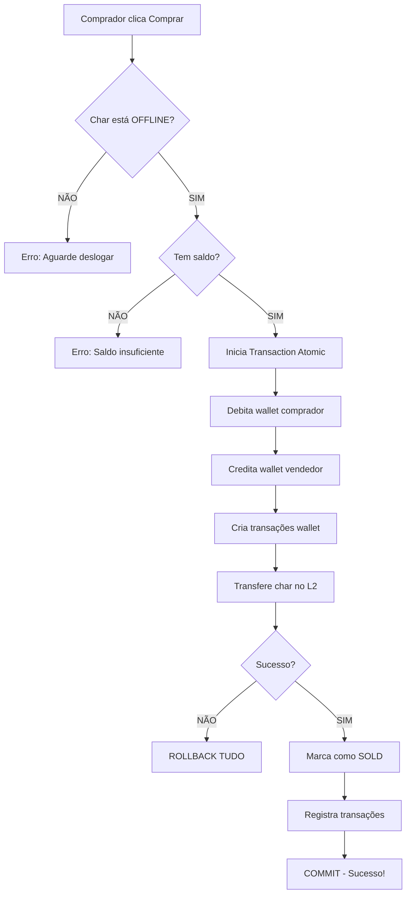

# 🎮 Marketplace de Personagens - PDL

## 📋 Índice

- [Visão Geral](#visão-geral)
- [Arquitetura](#arquitetura)
- [Funcionalidades](#funcionalidades)
- [Fluxo de Compra/Venda](#fluxo-de-compravenda)
- [Segurança](#segurança)
- [Integração com Wallet](#integração-com-wallet)
- [Interface de Usuário](#interface-de-usuário)
- [Modelos de Dados](#modelos-de-dados)
- [API e Serviços](#api-e-serviços)

---

## 🎯 Visão Geral

O **Marketplace de Personagens** é um sistema completo de compra e venda de personagens do Lineage 2, totalmente integrado ao ecossistema PDL. Permite que jogadores negociem seus personagens de forma segura, automática e transparente.

### Características Principais

- ✅ **Compra/Venda Segura** - Transações 100% protegidas
- ✅ **Integração com Wallet** - Débito/Crédito automático em R$
- ✅ **Transferência Automática** - Personagem vai direto para a conta do comprador
- ✅ **Validação de Segurança** - Apenas personagens offline podem ser negociados
- ✅ **Histórico Completo** - Rastreabilidade total de todas as transações
- ✅ **Interface Gamer** - Design moderno com efeitos visuais épicos
- ✅ **Responsivo** - Funciona perfeitamente em desktop e mobile

---

## 🏗️ Arquitetura

O Marketplace segue rigorosamente a **arquitetura do PDL**, separando responsabilidades entre:

### 1. Camada de Queries (L2 Database)
**Localização:** `apps/lineage/server/querys/query_*.py`

```python
class LineageMarketplace:
    """
    Métodos que interagem APENAS com o banco Lineage 2.
    Realiza SELECT e UPDATE em tabelas originais do L2.
    """
    
    @staticmethod
    def get_user_characters(account_name):
        # Busca personagens da conta no banco L2
        
    @staticmethod
    def get_character_details(char_id):
        # Busca detalhes completos do personagem
        
    @staticmethod
    def verify_character_ownership(char_id, account_name):
        # Verifica se o char pertence à conta
        
    @staticmethod
    def transfer_character_to_account(char_id, new_account_name):
        # TRANSFERE o personagem para outra conta
        # UPDATE characters SET account_name = ? WHERE charId = ?
```

**Princípio:** Query classes só fazem SELECT e UPDATE em tabelas originais do L2.

### 2. Camada de Modelos (Django)
**Localização:** `apps/lineage/marketplace/models.py`

```python
# Modelos gerenciados pelo Django ORM
- CharacterTransfer    # Registro de vendas/compras
- MarketplaceTransaction  # Histórico financeiro
- ClaimRequest         # Disputas/Reivindicações
```

**Princípio:** Dados do site ficam no banco Django, não no banco L2.

### 3. Camada de Serviços (Business Logic)
**Localização:** `apps/lineage/marketplace/services.py`

```python
class MarketplaceService:
    """
    Contém TODA a lógica de negócio.
    Orquestra Django Models + Lineage Queries + Wallet.
    """
    
    @staticmethod
    @transaction.atomic
    def purchase_character(buyer, transfer_id):
        # 1. Validações
        # 2. Verificar saldo
        # 3. Debitar wallet
        # 4. Creditar wallet
        # 5. Transferir no L2
        # 6. Registrar tudo
```

**Princípio:** Services coordenam operações complexas com transações atômicas.

### 4. Camada de Views (Django)
**Localização:** `apps/lineage/marketplace/views.py`

```python
# Views processam requests e renderizam templates
- marketplace_list()
- character_detail()
- sell_character()
- buy_character()
- my_sales()
- my_purchases()
```

---

## ⚙️ Funcionalidades

### 1. Listagem de Personagens
**URL:** `/app/marketplace/`

- Mostra todos os personagens à venda
- Cards visuais com informações:
  - Nome do personagem
  - Level e Classe
  - PvP kills, PK count
  - Clan
  - Preço em R$
- Filtro automático de GMs (não aparecem)
- Grid responsivo (3 colunas desktop, 1 coluna mobile)

### 2. Vender Personagem
**URL:** `/app/marketplace/sell/`

**Validações:**
- ✅ Personagem deve pertencer ao usuário
- ✅ Personagem deve estar OFFLINE
- ✅ Personagem não pode ser GM (accesslevel > 0)
- ✅ Personagem não pode estar já listado
- ✅ Preço deve ser maior que 0

**Processo:**
1. Usuário seleciona personagem do dropdown
2. Define preço em R$
3. Adiciona observações (opcional)
4. Sistema valida tudo
5. Cria listagem no marketplace

### 3. Comprar Personagem
**URL:** `/app/marketplace/character/{id}/`

**Validações:**
- ✅ Personagem deve estar à venda
- ✅ Personagem deve estar OFFLINE
- ✅ Comprador não pode ser o vendedor
- ✅ Comprador deve ter wallet
- ✅ Comprador deve ter saldo suficiente

**Processo Atômico:**
1. Verifica todas as condições
2. **Debita** R$ da wallet do comprador
3. **Credita** R$ na wallet do vendedor
4. Cria transações de wallet (histórico)
5. **Transfere personagem** no banco L2
6. Atualiza `account_name` do char
7. Marca como vendido
8. Registra tudo

**Se QUALQUER passo falhar:**
- ❌ Rollback completo
- ✅ Wallet volta ao normal
- ✅ Personagem fica na conta original
- ✅ Nada é registrado

### 4. Minhas Vendas
**URL:** `/app/marketplace/my-sales/`

Mostra personagens que o usuário está vendendo:
- Status: À VENDA, VENDIDO, CANCELADO
- Informações do comprador (se vendido)
- Data de listagem e venda
- Botão "Cancelar Venda" (apenas se status = for_sale)

### 5. Minhas Compras
**URL:** `/app/marketplace/my-purchases/`

Mostra personagens que o usuário comprou:
- Informações do vendedor
- Data e hora da compra
- Valor pago
- Status da transação

---

## 🔄 Fluxo de Compra/Venda

### Fluxo de Venda (Vendedor)



### Fluxo de Compra (Comprador)



---

## 🔐 Segurança

### 1. Validação de Propriedade
```python
LineageMarketplace.verify_character_ownership(char_id, account_name)
```
- Garante que apenas o dono pode vender
- Consulta direta no banco L2

### 2. Validação de Status OFFLINE
```python
if char_details.get('online', 0) == 1:
    raise ValidationError("Personagem está online!")
```

**Por que é crítico:**
- ❌ Transferir char online pode causar crash
- ❌ Pode duplicar personagem
- ❌ Pode perder itens/progresso
- ✅ Offline garante transferência segura

### 3. Transações Atômicas
```python
@transaction.atomic
def purchase_character(...):
    # TUDO ou NADA
```

**Garante:**
- Se wallet falhar → Nada acontece
- Se L2 falhar → Wallet reverte
- Se DB Django falhar → Tudo reverte

### 4. Locks de Database
```python
CharacterTransfer.objects.select_for_update().get(...)
Wallet.objects.select_for_update().get(...)
```

**Previne:**
- Race conditions
- Dupla compra do mesmo char
- Saldo negativo por compras simultâneas

### 5. Filtros de GM
```python
# GMs (accesslevel > 0) NÃO podem vender
characters = [char for char in characters if char.get('accesslevel', 0) == 0]
```

---

## 💰 Integração com Wallet

### Sistema de Pagamento

O Marketplace usa **exclusivamente** o sistema de Wallet do PDL:

```python
# Compra de personagem por R$ 150.00

COMPRADOR:
wallet.saldo -= 150.00
TransacaoWallet.create(
    tipo='SAIDA',
    valor=150.00,
    descricao='Compra de personagem: MyKill',
    origem='Marketplace',
    destino='vendedor_username'
)

VENDEDOR:
wallet.saldo += 150.00
TransacaoWallet.create(
    tipo='ENTRADA',
    valor=150.00,
    descricao='Venda de personagem: MyKill',
    origem='comprador_username',
    destino='Marketplace'
)
```

### Moeda

- **Única moeda:** BRL (Real Brasileiro)
- **Campos currency:** Fixados em 'BRL', `editable=False`
- **Display:** Sempre "R$" na interface

### Rastreabilidade

Todas as transações são registradas em:

1. **TransacaoWallet** (histórico da carteira)
2. **MarketplaceTransaction** (histórico do marketplace)

Isso permite:
- Auditoria completa
- Reconciliação de saldos
- Relatórios financeiros
- Detecção de fraudes

---

## 🎨 Interface de Usuário

### Design System

**Estilo:** Gamer/Cyberpunk com elementos neon

**Paleta de Cores:**
- Roxo místico: `#6f42c1`
- Rosa energia: `#e83e8c`
- Ciano mágico: `#0dcaf0`
- Fundo escuro: `rgba(18, 18, 32, 0.98)`
- Textos claros: `#ffffff`, `#cbd5e1`

**Tipografia:**
- Font principal: `'Orbitron'` (estilo futurista)
- Uppercase em títulos e badges
- Letter-spacing ajustado para legibilidade

**Efeitos Visuais:**
- Gradientes animados nas bordas
- Box-shadows neon
- Backdrop blur
- Hover effects 3D
- Shine/pulse animations
- Partículas e fireworks (JavaScript)

### Componentes

#### Header Principal
```
╔══════════════════════════════╗
║       🐉 (dragão flutuante) ║
║  MARKETPLACE DE PERSONAGENS  ║
║  🛡️ Compre e venda épicos... ║
║  [👥 1] [🔥 LIVE] [✓ 100%]  ║
╚══════════════════════════════╝
```

#### Action Cards
```
╔════════════════════════════════════╗
║ [🟢] VENDER PERSONAGEM        →  ║
║      Liste seu personagem...      ║
╠════════════════════════════════════╣
║ [🟣] MINHAS VENDAS             →  ║
║      Personagens que você vende... ║
╠════════════════════════════════════╣
║ [🔵] MINHAS COMPRAS            →  ║
║      Personagens adquiridos...     ║
╚════════════════════════════════════╝
```

#### Character Cards
```
╔════════════════════════════╗
║ LVL 85   DUELIST          ║ ← Header gradiente
║                            ║
║ MYKILL                     ║ ← Nome branco brilhante
║ ⚔️ PVP: 245  💀 PK: 12    ║ ← Stats compactas
║ 🛡️ Clan: DragonKnights    ║
║                            ║
║      PREÇO                 ║ ← Box gradiente rosa/roxo
║    R$ 150.00               ║
║                            ║
║   [Ver Detalhes]           ║ ← Botão épico
╚════════════════════════════╝
```

### Responsividade

**Desktop (>768px):**
- Grid de 3 colunas
- Stat boxes lado a lado
- Action cards horizontais

**Mobile (≤768px):**
- Grid de 1 coluna
- Elementos empilhados
- Touch-friendly
- Fontes ajustadas

---

## 📊 Modelos de Dados

### CharacterTransfer

Registro principal de uma venda/compra.

```python
class CharacterTransfer(BaseModel):
    # Dados do Personagem (snapshot do L2)
    char_id = IntegerField()          # ID no banco L2
    char_name = CharField(max_length=35)
    char_level = IntegerField()
    char_class = IntegerField()
    pvp_kills = IntegerField(null=True)
    pk_count = IntegerField(null=True)
    
    # Contas
    old_account = CharField(max_length=45)  # Conta original
    new_account = CharField(null=True)      # Conta destino (após venda)
    
    # Usuários Django
    seller = ForeignKey(User)               # Vendedor
    buyer = ForeignKey(User, null=True)     # Comprador
    
    # Transação
    price = DecimalField(max_digits=10, decimal_places=2)
    currency = CharField(default='BRL', editable=False)
    
    # Status
    status = CharField(choices=STATUS_CHOICES)
    # Opções: pending, for_sale, sold, cancelled, disputed
    
    # Timestamps
    listed_at = DateTimeField(auto_now_add=True)
    sold_at = DateTimeField(null=True)
    
    # Extras
    notes = TextField(blank=True)
```

### MarketplaceTransaction

Histórico de transações financeiras do marketplace.

```python
class MarketplaceTransaction(BaseModel):
    transfer = ForeignKey(CharacterTransfer)
    transaction_type = CharField(choices=TYPE_CHOICES)
    # Opções: purchase, sale
    
    amount = DecimalField(max_digits=10, decimal_places=2)
    currency = CharField(default='BRL', editable=False)
    
    user = ForeignKey(User)
    status = CharField(choices=STATUS_CHOICES)
    # Opções: pending, completed, failed, refunded
    
    completed_at = DateTimeField(null=True)
```

### ClaimRequest

Sistema de disputas/reivindicações.

```python
class ClaimRequest(BaseModel):
    transfer = ForeignKey(CharacterTransfer)
    char_id = IntegerField()
    requester = ForeignKey(User)
    
    reason = TextField()
    status = CharField(choices=STATUS_CHOICES)
    # Opções: pending, approved, denied
    
    resolved_at = DateTimeField(null=True)
    resolved_by = ForeignKey(User, null=True)
    admin_notes = TextField(blank=True)
```

---

## 🔧 API e Serviços

### MarketplaceService

#### list_character_for_sale()
```python
def list_character_for_sale(user, char_id, account_name, price, currency='BRL', notes=''):
    """
    Lista um personagem para venda.
    
    Validações:
    1. Verifica ownership no L2
    2. Busca detalhes do char
    3. Verifica se está OFFLINE
    4. Verifica se já está à venda
    5. Cria CharacterTransfer
    
    Returns: CharacterTransfer object
    """
```

#### purchase_character()
```python
@transaction.atomic
def purchase_character(buyer, transfer_id):
    """
    Processa compra com integração total.
    
    Fluxo:
    1. Busca transferência (select_for_update)
    2. Valida comprador != vendedor
    3. Verifica char OFFLINE
    4. Verifica saldo suficiente
    5. Debita wallet comprador
    6. Credita wallet vendedor
    7. Cria transações marketplace
    8. Transfere char no L2
    9. Marca como SOLD
    
    Returns: CharacterTransfer object
    Raises: ValidationError se algo falhar (com rollback)
    """
```

#### cancel_sale()
```python
def cancel_sale(transfer_id, user):
    """
    Cancela uma venda.
    
    Validações:
    1. Apenas vendedor pode cancelar
    2. Apenas se status = pending ou for_sale
    3. Não pode cancelar se já vendido
    
    Returns: CharacterTransfer object
    """
```

#### transfer_character_ownership()
```python
@transaction.atomic
def transfer_character_to_account(transfer_id, new_account_name):
    """
    Transfere personagem no banco L2.
    (Chamado automaticamente por purchase_character)
    
    Executa:
    UPDATE characters 
    SET account_name = 'new_account'
    WHERE charId = X
    
    Returns: bool
    """
```

---

## 🛡️ Segurança e Proteções

### Transações Atômicas

**Todas as operações críticas usam `@transaction.atomic`:**

```python
@transaction.atomic
def purchase_character(...):
    # Se QUALQUER operação falhar:
    # - Database rollback automático
    # - Wallet reverte ao estado original
    # - Personagem não é transferido
    # - Nenhum registro é criado
```

### Locks de Linha (Row Locking)

```python
# Previne race conditions
CharacterTransfer.objects.select_for_update().get(id=X)
Wallet.objects.select_for_update().get(usuario=user)
```

**Cenário protegido:**
```
Usuário A clica "Comprar" às 14:00:00.000
Usuário B clica "Comprar" às 14:00:00.001

Resultado:
✅ A consegue (primeiro a adquirir lock)
❌ B recebe erro "já foi vendido"
```

### Validações de Negócio

1. **Ownership:** Char deve pertencer ao vendedor
2. **Online Status:** Char deve estar offline
3. **GM Filter:** GMs não podem vender/comprar
4. **Self-Purchase:** Não pode comprar próprio char
5. **Saldo:** Comprador deve ter R$ suficiente
6. **Status:** Apenas chars "for_sale" podem ser comprados

### Auditoria

Todas as ações são registradas:

```python
# Django Admin
CharacterTransfer    # Quem vendeu/comprou o quê
MarketplaceTransaction  # Fluxo de dinheiro
TransacaoWallet      # Movimentação de saldo
```

Campos de auditoria automática (BaseModel):
- `created_at` - Quando foi criado
- `updated_at` - Última modificação
- `is_active` - Soft delete

---

## 🎨 Arquivos Estáticos

### CSS
**Localização:** `apps/lineage/marketplace/static/marketplace/css/marketplace.css`

**Tamanho:** ~2000 linhas de CSS customizado

**Componentes:**
- Animações (@keyframes): borderRotate, dragonFloat, statPulse, pulse, glow, shine, neonPulse
- Headers: marketplace-header, marketplace-stats, stat-box
- Action Cards: action-card, action-icon, action-content
- Character Cards: character-card, character-badge, character-info, character-price
- Detail Pages: detail-item, seller-info, price-box
- Forms: form-section, input-group
- Status Badges: status-sale, status-sold, status-cancelled
- Responsive: Media queries para mobile

### JavaScript
**Localização:** `apps/lineage/marketplace/static/marketplace/js/marketplace.js`

**Recursos:**
- Sistema de partículas (hover/click)
- Fireworks em confirmações
- Diálogos customizados neon
- Loading animations épicas
- Notificações gamer-style
- Preview dinâmico de personagens
- Ripple effects

---

## 📁 Estrutura de Arquivos

```
apps/lineage/marketplace/
├── __init__.py
├── apps.py
├── admin.py                    # Django Admin config
├── choices.py                  # Enums (STATUS, CURRENCY, etc)
├── models.py                   # Django Models
├── services.py                 # Business Logic
├── urls.py                     # URL routing
├── views.py                    # Django Views
├── tests.py                    # Testes (TODO)
│
├── migrations/
│   └── 0001_initial.py
│
├── templates/marketplace/
│   ├── list.html              # Listagem principal
│   ├── character_detail.html  # Detalhes do char
│   ├── sell.html              # Formulário de venda
│   ├── my_sales.html          # Minhas vendas
│   └── my_purchases.html      # Minhas compras
│
└── static/marketplace/
    ├── css/
    │   └── marketplace.css    # Estilos customizados
    └── js/
        └── marketplace.js     # Interatividade
```

---

## 🚀 Instalação e Configuração

### 1. Adicionar ao INSTALLED_APPS

```python
# core/settings.py
INSTALLED_APPS = [
    ...
    'apps.lineage.marketplace',
]
```

### 2. Incluir URLs

```python
# core/urls.py
lineage_patterns = [
    ...
    path("marketplace/", include("apps.lineage.marketplace.urls")),
]
```

### 3. Executar Migrations

```bash
python manage.py makemigrations marketplace
python manage.py migrate marketplace
```

### 4. Adicionar ao Sidebar (Opcional)

```html
<!-- templates/includes/sidebar.html -->
<a href="">
    <i class="fas fa-store-alt"></i>
    Marketplace
</a>
```

---

## 🧪 Testes

### Cenários de Teste

#### 1. Venda Bem-Sucedida
```
✅ Login com conta que tem personagens
✅ Personagem está offline
✅ Lista personagem por R$ 100.00
✅ Aparece no marketplace
```

#### 2. Compra Bem-Sucedida
```
✅ Login com outra conta
✅ Adicionar R$ 150.00 na wallet
✅ Acessar marketplace
✅ Clicar em "Comprar Agora"
✅ Wallet debita R$ 150.00
✅ Vendedor recebe R$ 150.00
✅ Personagem aparece na conta do comprador no L2
```

#### 3. Validações
```
❌ Tentar vender char online → Erro
❌ Tentar vender char de outro → Erro
❌ Tentar comprar sem saldo → Erro
❌ Tentar comprar próprio char → Erro
❌ GM tentar vender → Não aparece na lista
```

---

## 📈 Métricas e Monitoramento

### KPIs Sugeridos

- Total de personagens listados
- Total de vendas concluídas
- Volume financeiro (R$ total transacionado)
- Tempo médio até venda
- Taxa de cancelamento
- Disputas abertas/resolvidas

### Queries Úteis

```python
# Personagens à venda
CharacterTransfer.objects.filter(status='for_sale').count()

# Vendas do mês
CharacterTransfer.objects.filter(
    status='sold',
    sold_at__gte=inicio_mes
).count()

# Volume financeiro
MarketplaceTransaction.objects.filter(
    status='completed',
    transaction_type='sale'
).aggregate(Sum('amount'))
```

---

## 🔮 Evoluções Futuras

### Possíveis Melhorias

1. **Sistema de Avaliações**
   - Comprador avalia vendedor
   - Reputação de traders

2. **Filtros Avançados**
   - Filtrar por classe
   - Filtrar por faixa de preço
   - Ordenação customizada

3. **Notificações**
   - Email quando char for vendido
   - Push notification de novas ofertas
   - Alertas de preço

4. **Sistema de Ofertas**
   - Comprador faz contraproposta
   - Vendedor aceita/recusa
   - Negociação privada

5. **Marketplace Premium**
   - Destaque de anúncios
   - Listagens prioritárias
   - Analytics do anúncio

6. **Garantia Estendida**
   - Período de garantia (7 dias)
   - Devolução em caso de problemas
   - Escrow system

7. **API REST**
   - Endpoints para mobile app
   - Integração com bots
   - Webhooks

---

## ⚠️ Considerações Importantes

### Legalidade

- Verificar ToS do Lineage 2
- RMT (Real Money Trading) pode ser contra regras
- Implementar apenas em servidores privados permitidos

### Performance

- Cache de listagens (Redis recomendado)
- Paginação para muitos anúncios
- Índices no banco de dados:
  ```python
  class Meta:
      indexes = [
          models.Index(fields=['status', '-listed_at']),
          models.Index(fields=['seller', '-listed_at']),
          models.Index(fields=['char_id']),
      ]
  ```

### Backup

- Backup regular do banco Django
- Backup do banco L2 antes de transferências
- Log de todas as transferências L2

---

## 🆘 Troubleshooting

### Personagem não aparece na listagem

**Possíveis causas:**
1. Personagem está online
2. Personagem é GM (accesslevel > 0)
3. Personagem já está listado
4. Conta não pertence ao usuário

**Solução:** Verificar logs e validações no `services.py`

### Erro ao comprar

**Possíveis causas:**
1. Saldo insuficiente
2. Personagem ficou online
3. Outro usuário comprou primeiro
4. Falha na conexão com banco L2

**Solução:** Mensagem de erro indica o problema. Transaction rollback garante que nada foi debitado.

### Personagem não transferiu

**Possíveis causas:**
1. Erro na query L2
2. Char_id inválido
3. Account_name inválido
4. Banco L2 offline

**Solução:** Verificar exception no log. Transaction rollback restaura wallet automaticamente.

---

## 📞 Suporte

Para dúvidas ou problemas:

1. Verificar logs: `logs/marketplace.log`
2. Verificar transações no Django Admin
3. Consultar histórico de TransacaoWallet
4. Abrir ClaimRequest se necessário

---

## 📝 Changelog

### v1.0.0 (November 2025)
- ✅ Implementação inicial do marketplace
- ✅ Integração com sistema de wallet
- ✅ Transferência automática de personagens
- ✅ Validação de status offline
- ✅ Interface gamer completa
- ✅ Sistema de proteções e validações
- ✅ Histórico completo de transações
- ✅ Responsividade mobile

---

## 👨‍💻 Desenvolvedores

**Arquitetura:** Baseada nos padrões do PDL
- Query Classes para L2 Database
- Services para Business Logic
- Models para Django Database
- Separação clara de responsabilidades

**Tecnologias:**
- Django 5.2.4
- SQLAlchemy (para L2 DB)
- PostgreSQL/MySQL (Django DB)
- MySQL (L2 DB)
- Bootstrap 5
- Font Awesome
- JavaScript Vanilla

---

## 📚 Referências

- [PDL Architecture](./ARCHITECTURE.md)
- [Wallet System](../apps/lineage/wallet/README.md)
- [Query Classes](../apps/lineage/server/querys/README.md)

---

**Desenvolvido com 💜 para a comunidade PDL**

